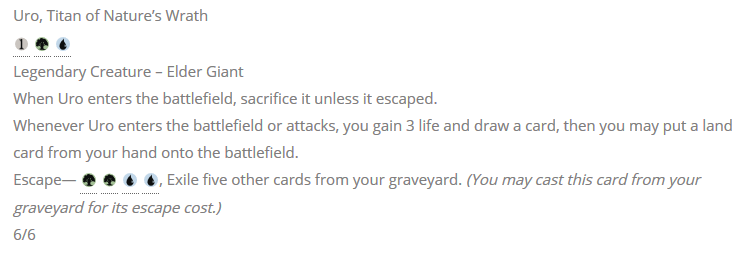
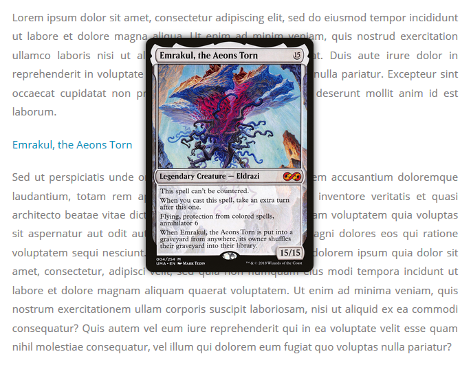
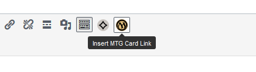

# MTG Publisher Tools
MTG Publisher Tools is a WordPress plugin for adding Magic: The Gathering content to your posts, pages, and themes. Content is generated using shortcodes, which output mana symbols and card popups. Magic-card data and assets are sourced from [Scryfall][1].

## Installation

## Getting Started

If you've used plugins like this before, the setup should be familiar. Copy the following into a post or page and check the preview:

    [mana_symbol key="{W}"]
    [oracle_text]{T}: Add {G}.[/oracle_text]
    My favorite card is [mtg_card]Silkbind Faerie[/mtg_card].

Hover over the link, and you should see an image of the card pop up. Voilà!

That should be all you need to get started. For a discussion of more advanced features, continue reading.

## Mana Symbols
Mana symbols are shown inline with text using the `[oracle_text]` and `[mana_symbol]` shortcodes.

The `[oracle_text]` tag is used to wrap entire passages and render text as it appears on cards. Each mana symbol between `[oracle_text]` tags will be replaced with a vector-based svg. Text between parentheses is also italicized.

    [oracle_text]Uro, Titan of Nature's Wrath
    {1}{G}{U}
    Legendary Creature – Elder Giant
    When Uro enters the battlefield, sacrifice it unless it escaped.
    Whenever Uro enters the battlefield or attacks, you gain 3 life and draw a card, then you may put a land card from your hand onto the battlefield.
    Escape—{G}{G}{U}{U}, Exile five other cards from your graveyard. (You may cast this card from your graveyard for its escape cost.)
    6/6[/oracle_text]

To display a single mana symbol, use the `[mana_symbol]` tag. It takes one argument, `key`, corresponding to the symbol to be inserted.

    [mana_symbol key="{15}"]

Mana symbol codes follow the official convention for plaintext symbols established by Magic's [Comprehensive Rules][2]. For reference, a list of all currently available symbols can be found in plugin settings on the "Mana Symbols" tab.

## Card Popups
Card popups make it easier for readers to follow along in articles when they may not know a particular card's text. They take the form of a hyperlink that activates when the user hovers over it with the mouse. Popup links are created using the `[mtg_card]` shortcode.

    [mtg_card]Emrakul, the Aeons Torn[/mtg_card]

That will display the default printing (usually the most recent) of the card in question. Different versions can be specified by passing additional parameters to the shortcode.

### Search Parameters
MTG Publisher Tools will try to narrow down its search using any filters you provide. The following parameters are available for use in `[mtg_card]` tags:

| Parameter  | Description                                  | Default           | Case-Sensitive |
|------------|----------------------------------------------|-------------------|----------------|
| `name`     | Full card name as it appears in Oracle text. | Shortcode content | No             |
| `set`      | Set code                                     | Most recent set   | No             |
| `number`   | Collector number                             | -                 | Yes            |
| `language` | Two-letter language code                     | EN (English)      | No             |
| `id`       | Unique Scryfall id                           | -                 | Yes            |

**Card Name**\
By default, the content inside the shortcode is used as the card name. This is overridden when you provide a value for the `name` parameter. Specifying `name` directly can be useful when you want to reference a card by an alternate name.

    [mtg_card name="Tarmogoyf"]Goyf[/mtg_card]

**Set**\
To specify a set, you must use a code recognized by Scryfall. For the list of valid codes, consult the [Scryfall set listing][3]. Pretty much every variant or promo you can think of is available.

    [mtg_card set="M10"]Lightning Bolt[/mtg_card]

**Collector Number**\
Collector number will usually be accompanied by the `set` parameter, to narrow down to a specific printing. This is helpful for sets with multiple versions of the same card.

    [mtg_card set="FEM" number="38c"]Hymn to Tourach (Cloak)[/mtg_card]

Note that the `number` parameter is *case-sensitive*. You can find collector numbers on [Gatherer][4] or Scryfall.

**Language**\
Right now the `language` parameter has limited support. For it to affect results, it *must* be accompanied by both `set` and `number`. This may be expanded in a future release.

As with set codes, you must use a language code that's [recognized by Scryfall][5].

    [mtg_card set="RAV" number="81" language="JA"]Dark Confidant[/mtg_card]

**Scryfall Id**\
This is an internal code Scryfall uses to uniquely identify each printing. To find this value for a card, you will have to query the [Scryfall API][6] directly.

    [mtg_card id="11bf83bb-c95b-4b4f-9a56-ce7a1816307a"]Delver of Secrets[/mtg_card]

### Split Cards and Backfaces
The official name of a split card has two forward slashes in between its two names, separated by spaces. You must use this syntax when linking to split cards.

    [mtg_card]Fire // Ice[/mtg_card]

Double-faced cards can be specified using the name from either face. The image returned will be the face matching that name. In cases where a double-faced card is identified by parameters other than name, the front face will be shown.

    [mtg_card]Search for Azcanta[/mtg_card]
    [mtg_card]Azcanta, the Sunken Ruin[/mtg_card]

### A Note on Spelling
Be careful to spell card names correctly, or your link will not render! Punctuation will generally not mess anything up, but a misspelling will. When in doubt, look up the card on Scryfall, Gatherer, or somewhere else to ensure the correct spelling.

## Toolbar Buttons
MTG Publisher Tools adds toolbar buttons to the WordPress editor to make inserting shortcodes easier. These buttons are accessible from within a Classic block, or while using the Classic editor.

To use them, highlight the text you want to wrap, and click the button. Ctrl+Z to undo.

## Caching and Updates
To assist with performance, MTG Publisher Tools stores some data locally in your database. This includes links to the location of symbols and card images (but not the images themselves). When a user views a page with Magic content, their browser will download the image from the CDN or external location.

MTG Publisher Tools checks periodically to see if your local data is out of date. When an update becomes available, site administrators are alerted by a notice at the top of the WordPress dashboard. Both automated checks and admin notices can be disabled on the Settings page.

Card images work slightly differently. A card uri will be cached for a determined period of time, after which it expires. The next time that image is requested, MTG Publisher Tools will re-fetch the data. This ensures your readers see the latest card images available. The default expiration period is one month, which can be changed in Settings.

[1]: https://scryfall.com/
[2]: http://magic.wizards.com/en/game-info/gameplay/rules-and-formats/rules
[3]: https://scryfall.com/sets
[4]: https://gatherer.wizards.com/Pages/Default.aspx
[5]: https://scryfall.com/docs/api/languages
[6]: https://scryfall.com/docs/api/cards/named